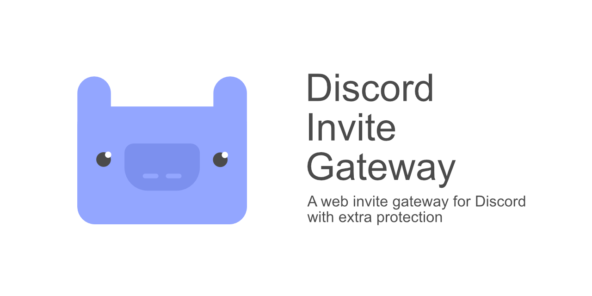

# Discord Invite Gateway

## About

Discord Invite Gateway is a web gateway that offers additional protection against automated usage of Discord invites.

## Features

- Modern responsive (yet basic) dark UI
- Google reCAPTCHA (v2)
- Guild information preview
- Countdown before expiration (w/ true expiration)
- Very dynamic configuration
- Error handling
- Debug mode (viewing the raw Discord API response)
- TOR exit node check

## Prerequisites

For this to function as intended, the following is required.

- PHP 7
- PHP cURL module
- Google account, with Google reCAPTCHA v2 (invisible) set up for the site this would be hosted on
- Discord account, with an application created (a bot)

## Configuring

There are a couple files that you will need to make changes to. Look out for the names of the constants and variables mentioned in the tables below and modify their values to what they should be.
- Create a Discord application (https://discordapp.com/developers/applications/)
- Prepare your Google reCAPTCHA v2 (invisible) site and secret key (https://www.google.com/recaptcha)
- Prepare your application (bot) client ID and token

### clientconfig.php

| Constant               | Description                                                                                                                                                            |
| ---------------------- | ---------------------------------------------------------------------------------------------------------------------------------------------------------------------- |
| UI_TITLE               | Page and header title                                                                                                                                                  |
| UI_ICON                | Favicon                                                                                                                                                                |
| UI_STYLE_PATH          | Path to stylesheet                                                                                                                                                     |
| UI_THEME_COLOUR        | Google Chrome's mobile header and status bar colour                                                                                                                    |
| RECAPTCHA_SITE_KEY     | Google reCAPTCHA site key                                                                                                                                              |
| JQUERY_PATH            | URI for jQuery library                                                                                                                                                 |
| JQUERY_SRI_INTEGRITY   | Sub-resource integrity hash (https://www.srihash.org/) for jQuery library                                                                                              |
| JQUERY_SRI_CROSSORIGIN | Sub-resource integrity cross-origin                                                                                                                                    |
| LIFETIME_SAFE          | If visited the very last second, have there still be an invite page with spare time to join -- add on amount of seconds set here to `expiry` (refer to the next table) |

### invite.php

| Variable    | Description                                                                                                                                                   |
| ----------- | ------------------------------------------------------------------------------------------------------------------------------------------------------------- |
| token       | Discord application (bot) token - [Wiki entry with how-to](https://github.com/Chikachi/DiscordIntegration/wiki/How-to-get-a-token-and-channel-ID-for-Discord) |
| domain      | Domain of where the Discord API is located                                                                                                                    |
| channel     | ID of the channel (refer to the link in the token part of this table)                                                                                         |
| uri         | The entire URI -- don't really need to touch that                                                                                                             |
| expiry      | Time (in seconds) before invite expiration (prefer to `LIFETIME_SAFE` in the previous table)                                                                  |
| maxuses     | Amount of times the same invite can be used                                                                                                                   |
| tempmem     | Temporary membership                                                                                                                                          |
| defaulticon | Icon to use if the guild has no icon set                                                                                                                      |
| ua          | User agent -- refer to [Discord's documentation regarding UA format](https://discordapp.com/developers/docs/reference#http-api)                               |
| grcuri      | Google reCAPTCHA API URI                                                                                                                                      |
| grcseckey   | Google reCAPTCHA secret key                                                                                                                                   |
| ctimeout    | cURL request timeout (in seconds)                                                                                                                             |
| torchk      | Optional TOR exit node check (enabled by default)                                                                                                             |

- To enable debugging, set the constant `DEBUG` (in the `core` class) to `true`

### Adding the bot

Once you have all of that set up, add the bot to a guild of your choice using `https://discordapp.com/oauth2/authorize?client_id={CLIENT_ID}&scope=bot&permissions=1`. Replace `{CLIENT_ID}` with your application's (bot's) client ID. `permissions` with `1` only grants the `CREATE_INSTANT_INVITE` permission which is required for the bot to create invites.
